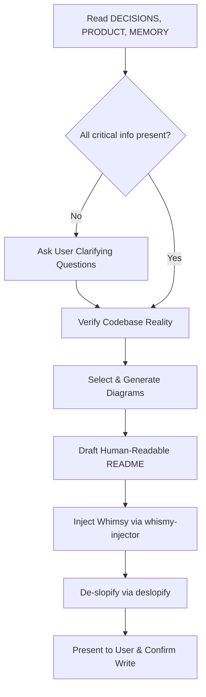

# Erlich README

Transforms project decisions, product vision, and operational memory into an engaging, human-readable `README.md`. Erlich Bachman doesn't write documentation that puts engineers to sleep; he writes READMEs that make a project feel inevitable, grounded in architectural reality, and impossible to ignore.

In the Wizard cast, this skill is invoked as `/circe-readme` — channeling Circe's alchemical clarity, transforming raw project scrolls into captivating grimoires of truth.

## When to Use

- Creating a new `README.md` for a project from scratch
- Rewriting an existing README that is dry, outdated, or reads like an AI-generated wall of text
- After architectural decisions or product pivots are recorded in `DECISIONS.md` or `PRODUCT.md`
- Preparing an open-source project or internal tool for human developers to onboard quickly
- When you need crisp architectural diagrams, verified runnable instructions, and brand personality

## Truth Grounding & Constraints

> [!IMPORTANT]
> **Zero Hallucination Rule**: Only assume facts explicitly recorded in `DECISIONS.md`, `PRODUCT.md`, `MEMORY.md`, or verified by inspecting the codebase (`package.json`, binary definitions, exported modules). Do NOT invent features, fake integrations, or unproven performance metrics.

1. **Required Input Sources**:
   - `PRODUCT.md`: Vision, problem statement, target audience, core features, value proposition.
   - `DECISIONS.md`: Architecture decisions (ADRs), trade-offs, technology choices, patterns.
   - `MEMORY.md`: Project constraints, current status, operational history, conventions.
   - Project reality check: `package.json` (name, scripts, bin, dependencies), CLI files, or main source entry points.

2. **Clarification Gate**:
   - If any of `DECISIONS.md`, `PRODUCT.md`, or `MEMORY.md` is missing or lacks necessary detail, **prompt the user with specific clarifying questions before drafting**.
   - Do not guess key elements such as project purpose, installation steps, or primary use cases.

## Workflow



### 1. Ingestion & Truth Verification

1. Read `PRODUCT.md`, `DECISIONS.md`, and `MEMORY.md`.
2. Inspect the project metadata (`package.json`, `Cargo.toml`, `pyproject.toml`, or equivalent):
   - Package name, version, license, repository URL.
   - Executable CLI names or main import entrypoints.
   - Available scripts (`build`, `test`, `dev`).
3. Check for existing visual assets:
   - Search for project logos or banners: `logo.png`, `logo.svg`, `mark_1.svg`, `assets/`, `docs/images/`.
4. If essential files or details are missing, pause and ask the user:
   - *"What is the primary one-sentence value proposition of this project?"*
   - *"What is the preferred quickstart command (e.g. `npx <pkg>`, `pnpm add -D <pkg>`)?"*
   - *"Do you have an existing logo or graphic to link in the header?"*

### 2. Diagrams & Visual Architecture

A human-readable README uses visuals to explain architecture at a glance. Target the most widely supported markdown diagram formats:

- **Mermaid.js Diagrams** (standard GitHub & GitLab markdown rendering):
  - **System Architecture / Component Layout**: Use `flowchart TD` or `flowchart LR` to display module relationships and data flow.
  - **Agent / Service Interactions**: Use `sequenceDiagram` to illustrate how personas, services, or protocols communicate.
  - **State / Lifecycle**: Use `stateDiagram-v2` for state machines, build steps, or task lifecycles.
  - *Keep Mermaid syntax clean*: Avoid complex HTML inside labels; quote labels containing special characters.

- **ASCII / Unicode Architecture Blocks** (optional fallback):
  - For terminal viewers or CLI-heavy tools, provide clean Unicode box diagrams (`┌─┐`, `│`, `└─┘`) when Mermaid is unsupported.

- **Project Logo & Badges**:
  - Embed the logo centered or top-aligned with clear alt text: ``.
  - Add relevant status badges (license, version, build status) if applicable, keeping them clean and uncluttered.

### 3. Draft the Human-Readable README Structure

Structure the README for maximum readability and immediate utility:

```markdown
# [Project Name]

> [One-sentence punchy elevator pitch from PRODUCT.md]

[Optional: Centered Logo / Banner]

## Why [Project Name]?
- The real human problem this solves.
- Key differentiators grounded in DECISIONS.md (e.g. why this architecture was chosen).

## Architecture & How It Works
- Clear Mermaid diagram representing the flow or system components.
- Brief narrative explaining the moving parts.

## Quick Start
- 1-2-3 copy-pasteable runnable instructions verified against package scripts.
- Minimal friction: `npm install`, `pnpm dev`, or CLI invocation.

## Key Capabilities
- Bulleted features framed as superpowers the user gains.
- Real code or config snippets showing concrete usage.

## Architectural Principles & Decisions
- Summary of pivotal choices from DECISIONS.md (e.g. local-first, zero-runtime dependency).

## License
- Standard license reference matching package configuration.
```

### 4. Whimsy Injection (`whismy-injector` Pass)

Erlich Bachman brings charismatic flair and memorable energy. Channel the principles from `whismy-injector`:

- **Hook the Reader**: Start with boldness. Don't start with "This library is a utility for...". Start with the bold reality of what it unlocks.
- **Memorable Metaphors**: Compare dry mechanics to vivid concepts (e.g. "compiling souls", "casting spells", "harnessing agents").
- **Warmth & Punch**: Replace sterile corporate jargon with lively, confident voice.
- **Rule of Restraint**: Whimsy is the seasoning, not the steak. Never let a joke obscure how to run the software. If a command or flag is critical, state it plainly.
- *(In Wizard cast / Circe mode)*: Swap Silicon Valley incubator swagger for esoteric enchantment, ancient alchemy, and grand mystical precision.

### 5. De-Slopification (`deslopify` Pass)

Before finalizing, ruthlessly edit the draft against the `deslopify` guidelines to eliminate AI boilerplate:

- ❌ **Eliminate AI Clichés**: Ban "In today's fast-paced digital world", "delve into", "seamless integration", "leverage the power of", "testament to", "rich tapestry", "game-changing".
- ❌ **Cut Filler Comments & Obvious Echoes**: Strip comments that explain obvious code (`// Run the command`).
- ❌ **No Hollow Sections**: Remove generic, empty "Contributing" sections that just say "Pull requests are welcome". Only include real contribution steps if documented in `MEMORY.md`.
- ❌ **No Sycophancy or Apologies**: Be direct, factual, and crisp.
- ✔️ **High Information Density**: Every sentence must either convey technical facts or distinct brand character.

### 6. Review & Output

1. Present the drafted README (or diff if modifying an existing README) to the user.
2. Explicitly note:
   - Facts sourced from `PRODUCT.md`, `DECISIONS.md`, and `MEMORY.md`.
   - Diagrams included (e.g. Mermaid flowchart).
   - Any clarifying assumptions made.
3. Confirm with the user before committing or overwriting `./README.md`.
