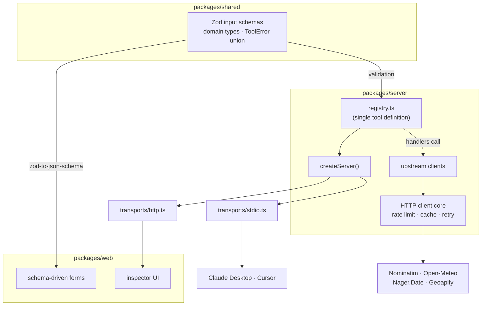

# Bearings MCP

> A place name goes in. A structured location, a stay forecast, or an honest
> walking-distance read on the neighbourhood comes out — over MCP, with the
> upstream cost of every call on the table.

Bearings is an MCP server with three tools backed by public HTTP APIs, plus a
React inspector that talks to it live to prove the two never drift apart.

It was built as a technical take-home for a hotel chain's engineering team. The
brief asked for a small MCP server; the interesting parts are the constraints
around it — a geocoder that bans your IP at 1 request per second, a POI API
metered in credits, and agent callers that pay by the token for every field you
hand back. This README is the argument for why each piece is shaped the way it
is.

```
resolve_destination          fuzzy name → structured Location
    ├─→ get_destination_brief    forecast + public holidays for a stay
    └─→ analyse_neighbourhood    POI density profile around a point
```

Upstreams: [Nominatim](https://nominatim.org/) (geocoding), [Open-Meteo](https://open-meteo.com/)
(forecast), [Nager.Date](https://date.nager.at/) (holidays), [Geoapify Places](https://www.geoapify.com/places-api/) (POI).

---

## Quick start

Node 22 or newer, [pnpm](https://pnpm.io/) 11. Clean clone to a running server:

```bash
git clone <repo-url> bearings-mcp && cd bearings-mcp
pnpm install
pnpm build
cp .env.example .env      # then set GEOAPIFY_API_KEY — see below
```

Measured on a clean clone with a warm pnpm store: `pnpm install` 20s, `pnpm build`
10s, ~30s total. A cold pnpm store adds package download time; still well under
two minutes on a normal connection.

Only `GEOAPIFY_API_KEY` is required — get a free one at
[geoapify.com](https://www.geoapify.com/) (3,000 credits/day). The server checks
it is present at boot and exits with a clear message if it is not, rather than
failing on the first `analyse_neighbourhood` call. Nominatim, Open-Meteo and
Nager.Date need no key.

`BEARINGS_HTTP_PORT`, `BEARINGS_HTTP_HOST` and `BEARINGS_ALLOWED_ORIGINS` are
optional and default to `3000`, `127.0.0.1`, and Vite's dev server
(`http://localhost:5173,http://127.0.0.1:5173`).

### Run it — two transports

```bash
node packages/server/dist/cli.js                     # stdio only (default) — Claude Desktop, Cursor
node packages/server/dist/cli.js --transport http    # Streamable HTTP only — the inspector
node packages/server/dist/cli.js --transport both    # both at once
```

`--transport` defaults to `stdio` with no flag, so every existing Claude Desktop
or Cursor config that points at the `bearings-mcp` bin (or directly at
`dist/transports/stdio.js`) keeps working unchanged.

Smoke-test stdio without a client by piping JSON-RPC frames in:

```bash
printf '%s\n' \
  '{"jsonrpc":"2.0","id":1,"method":"initialize","params":{"protocolVersion":"2024-11-05","capabilities":{},"clientInfo":{"name":"smoke","version":"0"}}}' \
  '{"jsonrpc":"2.0","method":"notifications/initialized"}' \
  '{"jsonrpc":"2.0","id":2,"method":"tools/list"}' \
  '{"jsonrpc":"2.0","id":3,"method":"tools/call","params":{"name":"echo","arguments":{"message":"hi"}}}' \
  | node packages/server/dist/cli.js
```

### Run the inspector

```bash
node packages/server/dist/cli.js --transport http    # terminal 1
pnpm --filter @bearings/web dev                       # terminal 2 → http://localhost:5173
```

For wiring Claude Desktop specifically, see `packages/server/AGENTS.md`.

---

## The three tools

| Tool | Input | Returns | Upstreams |
|---|---|---|---|
| `resolve_destination` | fuzzy place name (+ optional country) | one structured `Location`, or `AMBIGUOUS` with ranked candidates, or `NOT_FOUND` | Nominatim |
| `get_destination_brief` | an already-resolved `Location` + stay dates | daily forecast + public holidays for the window, with a per-upstream `sources` block | Open-Meteo, Nager.Date |
| `analyse_neighbourhood` | a coordinate + radius | POI density per walking-distance domain (nightlife, dining, transit, green space, retail, culture), with venue counts, per-ring breakdown, and credits consumed | Geoapify Places |

Every tool takes `detail: "brief" | "full"` (default `brief`). A fourth tool,
`echo`, is a permanent diagnostic that proves registry-to-transport wiring end
to end.

---

## Architecture

Three packages, one pnpm workspace:

| Package | Purpose |
|---|---|
| `packages/shared` | Zod schemas, domain types, error taxonomy — imported by both server and web |
| `packages/server` | MCP registry, transports, tool handlers, upstream clients, spatial analysis |
| `packages/web` | Development inspector: schema-driven forms, response viewer, cost tracking |



The load-bearing idea: **the Zod schema is the single source of truth for a
tool's input.** `packages/server` calls `safeParse` on it before a handler runs
and advertises it as JSON Schema in `tools/list`; `packages/web` runs
`zodToJsonSchema` over the *same import* to lay out the form. Add a tool to the
registry and its inspector form appears with zero changes in `packages/web`. The
inspector exists to demonstrate that property live — not to ship as a product.

---

## Design decisions

`DECISIONS.md` is the append-only log with dates and the alternatives weighed at
the time. This section is the reasoning in prose.

### Three tools sharing one primitive — not one mega-tool

`resolve_destination` produces a `Location`; the other two consume one. A single
`destination_intel(name, {weather?, neighbourhood?})` tool would collapse that
into one call, and it was rejected on three counts:

- **Token cost is per field returned.** An agent that only needs coordinates
  should not pay to serialise a forecast and forty POIs it did not ask for. Split
  tools let the caller buy exactly the payload it needs (and `detail` narrows it
  further).
- **The branches fail differently and cost differently.** `get_destination_brief`
  composes two keyless upstreams and degrades to partial results.
  `analyse_neighbourhood` spends Geoapify credits and has a daily ceiling.
  Bundling them forces one error model and one latency profile onto two
  operations that genuinely have neither.
- **Composition is the agent's job.** Resolve once, then fan out to brief and
  neighbourhood in parallel off the same `Location` — that is a natural MCP
  usage pattern, and the shared `Location` type is what keeps the seam honest.

`get_destination_brief` and `analyse_neighbourhood` deliberately take an
already-resolved `Location`/coordinate and do **not** call `resolve_destination`
internally — the resolve step, with its `AMBIGUOUS` branch, stays visible to the
caller.

### Two transports from one registry

`registry.ts` is the only place tools are defined. Both transports call the same
`createServer()` and attach a transport — that is the whole of their job. Adding
a tool touches neither transport file.

- **stdio** speaks JSON-RPC over stdout for desktop MCP hosts. It is the default
  because every existing Claude Desktop / Cursor install points at it with no
  flag, and flipping the default would silently change what those configs boot on
  the next rebuild.
- **Streamable HTTP** is stateful — one session per connected client, keyed by
  `mcp-session-id`, each with its own `createServer()`-built `Server`. The
  inspector holds a long-lived client and relies on the GET SSE stream for
  server-initiated messages; both need a session that persists across calls. A
  single shared `Server` was rejected outright: it would interleave JSON-RPC
  request ids between two inspector tabs.

Transports contain zero business logic — that is an architecture invariant, not a
style preference.

### Why an API key when the brief says auth is not required

The brief means the **MCP server** needs no auth layer — no bearer tokens on
`tools/call`, no client identity. That still holds: the server authenticates no
one.

`GEOAPIFY_API_KEY` is not client auth. It is an **upstream credential** — the
key Geoapify issues to meter *our* POI usage against a free-tier quota. It is the
same category of thing as the descriptive `User-Agent` Nominatim requires:
configuration for talking to a third party, not a gate on our own callers. The
other three upstreams are keyless, so the server needs exactly one secret, and it
is validated at boot and never logged, bundled, or returned in an error (an
invariant with a standing manual review step).

### Why Nominatim stayed instead of consolidating onto Geoapify

Geoapify also does geocoding, so `resolve_destination` could have used it and
dropped an upstream. It did not, because:

- **Credits are the scarce resource.** Geoapify's free tier is 3,000 credits/day
  and `analyse_neighbourhood` is the tool that genuinely needs them. Routing the
  cheapest, most frequent operation — name resolution — through the metered
  upstream spends the budget on the wrong call.
- **The disambiguation signal lives in Nominatim's response.**
  `resolve_destination` returns the top hit only when its `importance` score
  leads the runner-up by a fixed gap, and returns `AMBIGUOUS` otherwise.
  `importance` is Nominatim's field; the heuristic is built on it.
- **Nominatim is keyless and the reference OSM geocoder.** One fewer credential,
  and coordinates/boundaries/canonical names are effectively static facts that
  cache for 30 days.

> Not yet in `DECISIONS.md` — flagging for David to confirm the reasoning and log
> it.

### Why Geoapify over Overpass for POI

Overpass adds a query-language learning cost and unpredictable server-side
timeouts for no credit saved. Geoapify Places is plain REST with a documented
category hierarchy, and its free tier covers the take-home with margin. ohsome
(aggregation only, no individual places) and Photon (too thin for category
filtering) were also considered.

### The HTTP client core

All upstream traffic routes through `packages/server/src/http/` — no bare
`fetch()` to an upstream, anywhere. The core provides four things a generic
request library does not:

- **Per-host token-bucket rate limiting.** Nominatim is pinned to 1 request per
  second because violations earn an hours-long IP ban.
- **`Retry-After` header precedence** on retry.
- **Per-attempt `AbortSignal` timeout** with a typed `TIMEOUT` error.
- **`ToolError` mapping** — every upstream failure becomes a structured error, a
  Geoapify quota surfacing as `QUOTA_EXCEEDED` rather than a generic wrap.

The cache is in-memory and bounded — no disk persistence. Fault injection
(`BEARINGS_FAULT_INJECTION=1`) raises simulated failures *inside* the core,
before the cache read, mapped through the same error path a real failure takes,
so the partial-result path can be demonstrated without unplugging the network.

### Cache TTL per upstream

Per-host, and justified by how fast the underlying data actually changes:

| Upstream | TTL | Reasoning |
|---|---|---|
| Nominatim | **30 days** | Coordinates, admin boundaries and canonical names are static geographic facts. A long TTL also keeps repeat lookups away from the 1 req/sec limit. |
| Open-Meteo | **6 hours** | Forecast models update roughly four times daily; 6h guarantees freshness without re-fetching during an active planning session. |
| Nager.Date | **365 days** | National holiday calendars are gazetted annually and invariant within a year. |
| Geoapify | **7 days** | POI density shifts over weeks, not hours. 7 days balances currency against the 3,000 credit/day quota. |

### `detail: brief | full` and the cost model

Two axes of cost move independently:

- **Context tokens move freely with `detail`.** `brief` is a lossy, validated
  projection of the full object — it drops evidence and echo fields, never
  changes the number of upstream calls. Switch between them per call at no
  upstream cost.
- **Geoapify credits move only upward, and only by explicit opt-in.**
  `limitPerCategory` defaults to 20 (one credit per domain) and `brief` cannot
  exceed it. `full` may raise it to 40 — a deliberate second credit bucket for a
  higher honest-count ceiling — but the default never changes, so nobody spends
  double by accident.

Measured with `pnpm --filter @bearings/server measure:tokens`, driving all three
tools through `createServer()` over an in-memory transport with the committed
fixtures. The token figure is the exact `_meta["bearings/tokens"]` block an agent
receives — read off the wire, not a second private estimate:

| Tool | Detail | Bytes | Approx. tokens | Worst-case tokens | Δ vs full | Geoapify credits |
|---|---|---:|---:|---:|---:|---:|
| `resolve_destination` | brief | 171 | 51 | 102 | −54% | — |
| `resolve_destination` | full | 329 | 111 | 222 | — | — |
| `get_destination_brief` | brief | 689 | 233 | 466 | −19% | — |
| `get_destination_brief` | full | 841 | 286 | 572 | — | — |
| `analyse_neighbourhood` | brief | 1403 | 468 | 936 | −68% | 6 |
| `analyse_neighbourhood` | full | 4200 | 1451 | 2902 | — | 6 |

- **Worst-case tokens** is `contentTokens × 2`: the MCP spec recommends
  serialising a response into both `content[0].text` and `structuredContent`
  (identical JSON), and a host that forwards both to the model pays twice.
- **Tokenizer is `o200k_base`** — a GPT BPE, not Claude's (no public Anthropic
  tokenizer exists). Good for comparing two shapes of the same payload; not a
  bill prediction.
- Both `analyse_neighbourhood` rows use the default `limitPerCategory` (20) across
  six domains, so credits are identical — the brief/full split is a token lever
  here, not a credit lever.
- A regression test asserts `brief` costs strictly fewer tokens than `full` for
  every real tool, so the distinction cannot quietly stop paying for itself.

### Density thresholds

`analyse_neighbourhood` rates each domain by **venue density in venues/km²**, not
raw count, so a rating is comparable across radii. One Geoapify call per domain at
the widest requested radius; inner walking rings (≈250 m / 500 m / 1 km, ~3/6/12
min) are partitioned client-side from the `distance` Geoapify returns per
feature, at no extra credit.

Thresholds live in a single named-constant block (`analysis/thresholds.ts`) and
are **per domain**, because a walkable dining scene and a walkable museum scene
are different densities:

| Domain | `medium` | `high` | Reasoning |
|---|---:|---:|---|
| `nightlife` | 8 | 20 | 20 bars inside a 6-min walk is unambiguously a nightlife district. |
| `dining` | 10 | 22 | The densest domain; `high` sits just under the count-capped ceiling. |
| `transit` | 6 | 15 | A handful of stops within a 3-min walk already means "well connected". |
| `greenSpace` | 2 | 5 | Parks are sparse even where present; one inside the ring is meaningful. |
| `retail` | 6 | 13 | Supermarkets and markets are low-count; a cluster signals a shopping area. |
| `culture` | 3 | 8 | Museums and galleries concentrate heavily; a few marks a cultural quarter. |

Every domain's `high` sits at or below the density a domain capped at 20 places
still reports within a 500 m ring, so a genuinely dense but count-capped domain
is never under-rated. When a domain hits the `limitPerCategory` ceiling its
`countCapped` flag is `true`, its density is a **lower bound**, and the
classifier may only ever raise such a rating — buckets stay monotonic in density.

> Calibration note: the reference readings behind these numbers are currently
> hand-derived estimates. A live re-calibration against named dense/quiet
> coordinates per domain is on the manual-review list; the "capped ratings only
> rise" guarantee holds regardless of the exact numbers.

### React Query in the inspector, custom core for upstreams

`@tanstack/react-query` handles loading/error/success state, request
de-duplication and cache invalidation in `packages/web` — exactly what it is good
at. It is a `packages/web` dependency only; `packages/server` importing
`@tanstack/*` is a forbidden practice. The MCP server is a plain Node process
with no component tree, and `query-core` provides none of the four things the
HTTP core exists for. The inspector also overrides React Query's product defaults
(`retry: false`, `refetchOnWindowFocus: false`) — a failed Geoapify call must
show the developer one failure, not three silent retries burning three credits.

### Errors are a discriminated union keyed on a string enum

`ToolErrorCode` is a TypeScript string enum; the `ToolError` union keys on its
members. This buys one declaration to navigate to, autocomplete at every
construction site, exhaustiveness checking on a `switch`, and a runtime value
list the `isToolError` type guard uses. Errors are always *returned* as a
`ToolError`, never thrown as strings.

---

## Known upstream risks

| Risk | Trigger | Mitigation in place |
|---|---|---|
| **Nominatim IP ban** | >1 request/second from one IP; missing `User-Agent` | Token-bucket limiter pinned to 1 req/sec per host; descriptive `User-Agent` sent on every call; 30-day cache |
| **Geoapify daily cap** | 3,000 credits/day exhausted (1 credit / 20 places) | `limitPerCategory` capped at 20 for `brief`; `detail` gates the ceiling; 7-day cache; cap exhaustion surfaces as `QUOTA_EXCEEDED`, not a generic failure |
| **Open-Meteo forecast horizon** | Stay dates beyond ~16 days out | Range fully outside → `NOT_FOUND` with the latest available date; partly outside → clamped, with `truncated: true` and the reason on the response |
| **Nager.Date year boundaries** | A stay spanning Dec 31 → Jan | Every calendar year the window touches is queried in parallel and merged; one year failing returns the other plus a `partial` marker |
| **Any single upstream down** | Transient outage, timeout | `get_destination_brief` returns the surviving upstream's data with `sources.<x>.status: "unavailable"` carrying the error; both down → one structured error with the more severe code |

---

## Trade-offs, and what more time would change

- **Geoapify fixtures are hand-shaped, not captured live.** The
  `analyse_neighbourhood` byte/token figures are a real serialisation cost of a
  real payload *shape*; the density reference readings are estimates. First
  follow-up: a live capture pass and threshold re-calibration against named
  coordinates.
- **Fault injection is per upstream host, not per domain.**
  `analyse_neighbourhood` queries Geoapify for all six domains, so faulting
  Geoapify takes all six down together. Per-domain granularity would mean
  threading a domain concept into the HTTP core — a real architectural cost for a
  demo affordance, deferred deliberately.
- **The token count is a GPT tokenizer.** It compares payload shapes well but is
  not Claude's tokenizer. If an official one ships, swap the encoding submodule —
  the import is already pinned so a dependency bump can't move the numbers
  silently.
- **The inspector's live end-to-end pass is partially by hand.** Page load,
  connection, `tools/list`, form generation, validation and a successful call
  were confirmed in a real browser; pin/compare/fault-panel interactions are
  covered by component tests plus a scripted MCP client against the real
  transport. A full manual click-through is on the review list.
- **No structured logging or metrics export.** Diagnostics go to stderr. Fine for
  a take-home; a real deployment would want request tracing and quota telemetry.

---

## Testing

```bash
pnpm test        # 476 tests across the three packages — all offline, deterministic
pnpm typecheck   # tsc --noEmit, every package (server runs src + test configs)
pnpm knip        # unused files, exports, dependencies across the workspace
pnpm lint        # biome check . — lint + format
```

Upstreams are mocked at the HTTP client core boundary, so the suite runs offline
with no live API calls. CI (`.github/workflows/ci.yml`) runs lint → knip → build
→ typecheck → test on every push and PR. See root `AGENTS.md` for the full
testing philosophy and Definition of Done.

---

## AI-assisted development

This project was built with heavy AI assistance, and hiding that would be the
wrong move for a role building an AI agents platform. The disclosure:

**Scaffolding — [Hocus](https://darkmagicstudios.com/products/hocus).** Hocus is
a tool the author develops. It was used to scaffold the agent personas, skills,
and per-harness configuration (`AGENTS.md`, `.claude/`, `.cursor/`, OpenCode,
Antigravity) so the same roster and rules apply across every harness that opened
the repo.

**Planning → tickets → execution.** The architecture was planned conversationally
in Claude, then broken into tickets in Linear (the `DMS-###` series). Foundations
and skeletons were laid first — shared schemas and domain types, the HTTP client
core, a walking-skeleton server that booted end to end over stdio — and only then
were feature tickets picked up individually, each in its own git worktree via
Orca (also an author tool). Some independent tickets ran in parallel — the three
upstream API clients, for instance, landed the same day.

**The agent roster** (defined in `.agents/agents/`, documented in root
`AGENTS.md`):

| Agent | Role |
|---|---|
| `founder` | Architectural governance, the hotel-enterprise constraint lens, stack decisions |
| `planner` | Drafts the plan for any non-trivial feature before code is written |
| `orchestrator` | Maintains the battle plans, splits them into assignable tasks, tracks blockers |
| `server-dev` | MCP tool handlers, upstream clients, HTTP core, shared schemas |
| `web-dev` | The React inspector — schema-driven forms, cost meters, transport hooks |
| `reviewer` | Audits every diff for the architecture invariants, schema strictness, and secret leakage |
| `qa` | Edge-case testing — coordinate extremes, ambiguous names, rate-limit stress, partial failures |
| `costs-cleaner` | Audits Geoapify credit consumption and token bloat in responses and prompts |

**Review process.** Three layers, in order:

1. **Invariant enforcement is codified.** The nine architecture invariants
   (`AGENTS.md`) are concrete and checkable — single registry, schemas in
   `packages/shared` only, no bare `fetch()`, `ToolError` never thrown as a
   string, named constants for every threshold, never loosen a schema without
   explicit instruction. `pnpm lint` / `typecheck` / `knip` / `test` gate every
   change and run in CI.
2. **The `reviewer` and `qa` agents** pass over the work before it is considered
   done — the reviewer for invariants and security, QA for real-world edge cases.
3. **The author reads every AI-generated diff before commit.** This is
   non-delegable and stated as such in `AGENTS.md`. A running "Manual Review
   Pending" list there tracks what still needs human sign-off — dependency
   licence checks, live API calibration, the full browser click-through — so
   nothing is assumed verified just because an agent reported success.
   `DECISIONS.md` is written by the author only; agents flag decisions, they do
   not log them.

Commits are authored under the author's name with AI assistance disclosed here
and in `AGENTS.md`.

---

## License

Released into the public domain — see [`LICENSE`](./LICENSE) (Unlicense).
