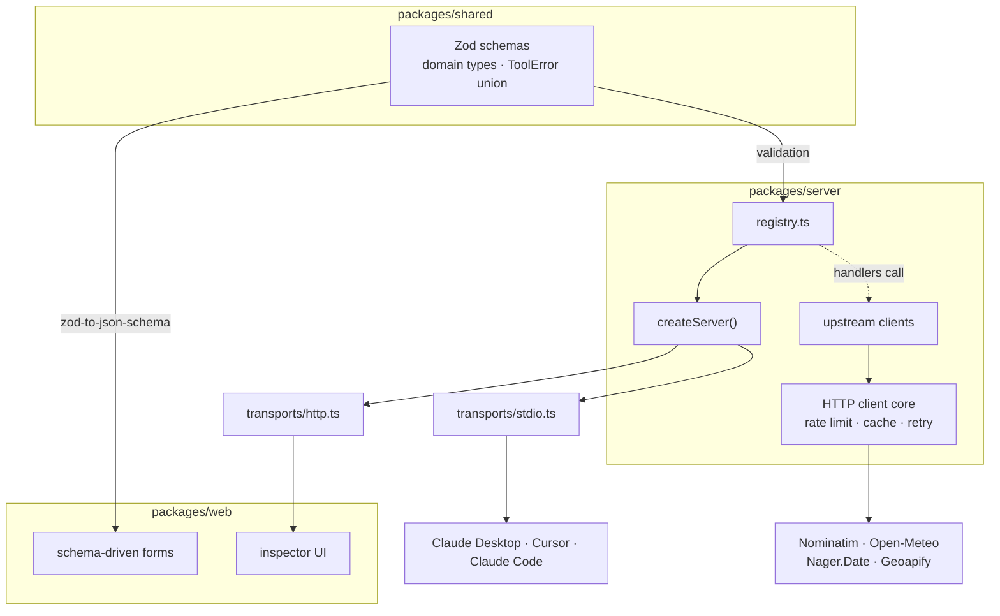

# Bearings MCP


> A place name goes in. A structured location, a stay forecast, or an honest walking-distance read on the neighbourhood comes out — with the upstream cost of every call on the table.

Bearings is an MCP server with three tools backed by public HTTP APIs, plus a React inspector that renders its forms from the server's own schemas — so the UI cannot drift from what the tools actually accept. Built as a take-home for a hotel chain's engineering team, and the interesting parts are all constraints: a geocoder that bans your IP at 1 req/sec, a POI API metered in credits, and agent callers that pay by the token for every field you hand back.

```
resolve_destination          fuzzy name → structured Location
    ├─→ get_destination_brief    forecast + public holidays for a stay
    └─→ analyse_neighbourhood    POI density profile around a point
```

Upstreams: [Nominatim](https://nominatim.org/) (geocoding), [Open-Meteo](https://open-meteo.com/) (forecast), [Nager.Date](https://date.nager.at/) (holidays), [Geoapify Places](https://www.geoapify.com/places-api/) (POI).

---

## Quick start

Node 22+, [pnpm](https://pnpm.io/) 11.

```bash
git clone <repo-url> bearings-mcp && cd bearings-mcp
pnpm install
cp .env.example .env   # then set GEOAPIFY_API_KEY
pnpm dev               # server on :3000 + inspector on :5173, browser opens
```

`pnpm dev` runs both halves from one terminal — the MCP server over Streamable
HTTP under `tsx watch`, and the Vite inspector, which it opens in your browser.
Ctrl-C stops both. `pnpm dev:server` and `pnpm dev:web` run them separately.
For a built, production-shaped run instead: `pnpm build && pnpm start:http`.

Only `GEOAPIFY_API_KEY` is required — free at [geoapify.com](https://www.geoapify.com/) (3,000 credits/day). The server validates it at boot and exits with a clear message if missing. Nominatim, Open-Meteo and Nager.Date need no key.

At boot the server loads the nearest `.env`, searching up from the working directory and then from its own location — so `node packages/server/dist/cli.js` from the repo root and a Claude Desktop spawn with an unrelated cwd both find the same file. Variables already set in the real environment win over the file.

Optional env: `BEARINGS_HTTP_PORT` (default `3000`), `BEARINGS_HTTP_HOST` (default `127.0.0.1`), `BEARINGS_ALLOWED_ORIGINS` (default Vite dev server), `BEARINGS_ALLOWED_HOSTS` (default loopback — the `Host`-header allowlist that guards against DNS rebinding).

```bash
pnpm start        # stdio (default) — Claude Desktop, Cursor, Claude Code
pnpm start:http   # Streamable HTTP — the inspector
pnpm start:both   # both at once
```

Each wraps `node packages/server/dist/cli.js [--transport …]`, which still works called directly.

### Test the HTTP transport with curl

Almada, Portugal — one command to start the server, one copy-paste to call a tool:

```bash
# terminal 1 — HTTP transport (needs GEOAPIFY_API_KEY in .env)
pnpm start:http   # http://127.0.0.1:3000/mcp
```

```bash
# terminal 2 — open a session, capture its id, call resolve_destination
SID=$(curl -s -D - http://127.0.0.1:3000/mcp \
  -H "content-type: application/json" \
  -H "accept: application/json, text/event-stream" \
  -d '{"jsonrpc":"2.0","id":1,"method":"initialize","params":{"protocolVersion":"2024-11-05","capabilities":{},"clientInfo":{"name":"curl","version":"0"}}}' \
  | grep -i '^mcp-session-id:' | cut -d' ' -f2 | tr -d '\r')

curl http://127.0.0.1:3000/mcp \
  -H "content-type: application/json" \
  -H "accept: application/json, text/event-stream" \
  -H "mcp-session-id: $SID" \
  -d '{"jsonrpc":"2.0","id":2,"method":"tools/call","params":{"name":"resolve_destination","arguments":{"query":"Almada, Portugal"}}}'
```

The transport is stateful — reuse `$SID` for every later call. Missing or unknown `mcp-session-id` returns `400`/`404` (`packages/server/src/transports/http.ts:1`).

Smoke-test stdio without a client:

```bash
printf '%s\n' \
  '{"jsonrpc":"2.0","id":1,"method":"initialize","params":{"protocolVersion":"2024-11-05","capabilities":{},"clientInfo":{"name":"smoke","version":"0"}}}' \
  '{"jsonrpc":"2.0","method":"notifications/initialized"}' \
  '{"jsonrpc":"2.0","id":2,"method":"tools/list"}' \
  '{"jsonrpc":"2.0","id":3,"method":"tools/call","params":{"name":"echo","arguments":{"message":"hi"}}}' \
  | node packages/server/dist/cli.js
```

Inspector (needs HTTP transport) — `pnpm dev` is the one-command path; to split it across terminals:

```bash
pnpm dev:server   # terminal 1 → http://127.0.0.1:3000/mcp
pnpm dev:web      # terminal 2 → http://localhost:5173
```


Pick a tool, fill in the form, hit call. The token count, worst-case estimate, and latency in that response panel aren't mocked up for this screenshot — they're the server's own `_meta` block, read straight off the wire.

---

## Try it in Claude Code

Claude Code speaks MCP over stdio, same as Claude Desktop. Point it at the built `cli.js` — no code changes required.

### 1. Build first

```bash
pnpm install && pnpm build
```

Verify the binary exists: `ls packages/server/dist/cli.js` should succeed. Without a build, Claude Code will start the server and immediately exit.

### 2. Make sure the key is reachable

Bearings loads `.env` by walking up from both `process.cwd()` and the server module directory (`packages/server/src/env.ts:32`), so a `.env` at the repo root works even when Claude Code spawns the server from a different working directory. Either of these is fine:

**Option A — `.env` file (simplest):**

```bash
cp .env.example .env
# edit .env and set GEOAPIFY_API_KEY=your_key_here
```

**Option B — pass it inline** when you register the server (no `.env` needed):

```bash
claude mcp add bearings -e GEOAPIFY_API_KEY=your_key_here -- node /absolute/path/to/bearings-mcp/packages/server/dist/cli.js
```

Replace `/absolute/path/to/bearings-mcp` with the real absolute path — Claude Code does not expand `~` or relative paths for MCP `command` entries.

If you already have a `.env` file, omit `-e GEOAPIFY_API_KEY=...`:

```bash
claude mcp add bearings -- node /absolute/path/to/bearings-mcp/packages/server/dist/cli.js
```

Scope flag (optional): add `-s project` to write to `.mcp.json` in the repo instead of the local config, or `-s user` for a global install. Default is `local`.

### 3. Verify the connection

```bash
claude mcp list          # should show bearings — ✓ connected
claude mcp get bearings  # details, transport, env
```

Inside any Claude Code session, `/mcp` shows the same servers and their tools. If the server exits on boot, `claude mcp get bearings` prints stderr — missing `GEOAPIFY_API_KEY` is the most common cause.

### 4. Call the tools

Open Claude Code in the repo and ask naturally, or invoke tools directly. Tool names appear namespaced as `mcp__bearings__<tool>`:

- `mcp__bearings__echo` — diagnostic, proves wiring: `{"message": "hi"}`
- `mcp__bearings__resolve_destination` — `{"query": "Alfama, Lisbon"}`
- `mcp__bearings__get_destination_brief` — takes a `Location` (from a previous `resolve_destination`) plus a stay: `{"location": {"name": "Lisbon", "coordinates": {"lat": 38.72, "lon": -9.14}, "countryCode": "PT"}, "stay": {"start": "2026-05-01", "end": "2026-05-04"}}`
- `mcp__bearings__analyse_neighbourhood` — `{"coordinates": {"lat": 38.71, "lon": -9.14}, "radiusM": 500}`

Example prompts to try:

```
Resolve "Lisbon" and tell me what you get back — is it ambiguous?
Using the Lisbon location you just resolved, get the destination brief for next week
Analyse the neighbourhood around 38.7115,-9.1449 within 500m, brief detail
```

Each response carries `_meta["bearings/tokens"]` (token estimate) and, for `analyse_neighbourhood`, a `credits` block — the inspector's CostMeter reads the same fields.

Put all three in one prompt and the model walks the chain itself — resolve the name, carry the `Location` forward, then read the neighbourhood off the coordinates it just got back:


That's the `resolve_destination → get_destination_brief → analyse_neighbourhood` tree from the top of this README, run end to end from a single sentence. The three shots below take the same flow apart, one tool at a time:


### 5. Project-scoped alternative (`.mcp.json`)

This repo already commits a `.mcp.json` at the root with a `bearings` entry, so `claude mcp add` is optional — Claude Code auto-discovers the file and prompts for approval on next launch. The committed entry is keyless and relies on `.env`:

```json
{
  "mcpServers": {
    "bearings": {
      "command": "node",
      "args": ["./packages/server/dist/cli.js"],
      "type": "stdio"
    }
  }
}
```

To pass the key inline instead of via `.env`, add `"env": { "GEOAPIFY_API_KEY": "${GEOAPIFY_API_KEY}" }` to that entry.

### 6. Remove when done

```bash
claude mcp remove bearings
# or: claude mcp remove bearings -s project   (if you used project scope)
```

---

## The three tools

| Tool | Input | Returns | Upstreams |
|---|---|---|---|
| `resolve_destination` | fuzzy place name (+ optional `countryCode`) | structured `Location`, or `AMBIGUOUS` with ranked candidates, or `NOT_FOUND` | Nominatim |
| `get_destination_brief` | resolved `Location` + `stay` dates | daily forecast + public holidays, with per-upstream `sources` block | Open-Meteo, Nager.Date |
| `analyse_neighbourhood` | coordinate + `radiusM` | POI density per walking-distance domain, with venue counts, per-ring breakdown, and `credits` consumed | Geoapify Places |

Every tool takes `detail: "brief" | "full"` (default `brief`). `echo` is a fourth, permanent diagnostic — it proves registry-to-transport wiring end to end.

---

## Architecture

Three packages, one pnpm workspace:

| Package | Purpose |
|---|---|
| `packages/shared` | Zod schemas, domain types, error taxonomy — imported by both server and web |
| `packages/server` | MCP registry, transports, tool handlers, upstream clients, spatial analysis |
| `packages/web` | Inspector — schema-driven forms, response viewer, cost tracking |



The load-bearing idea: **the Zod schema is the single source of truth.** `packages/server` validates with it and advertises it as JSON Schema in `tools/list`; `packages/web` renders the form from the same import via `zod-to-json-schema`. Adding a tool to `registry.ts` makes its inspector form appear with zero changes in `packages/web`.

Key invariants (see `AGENTS.md`):

- `registry.ts` is the only place tools are defined — transports are pure wiring.
- All upstream calls go through `packages/server/src/http/` — no bare `fetch()`.
- Errors are returned as the `ToolError` union, never thrown as strings.
- Derived ratings carry their evidence (`count`, `radiusM`, `rings`).

---

## Why it is shaped this way

`DECISIONS.md` is the dated log with alternatives considered; this is the short version.

- **Three tools sharing one primitive, not one mega-tool.** `resolve_destination` produces a `Location`; the other two consume it. A single `destination_intel` would force every caller to pay for a forecast and forty POIs it didn't ask for, and would collapse two different failure and cost profiles into one.
- **Two transports from one registry.** `stdio` is the default so existing desktop configs keep working with no flag. Streamable HTTP is stateful — one session per client, each with its own `createServer()` — so two inspector tabs don't interleave request ids.
- **Nominatim stays for geocoding even though Geoapify can geocode.** Nominatim is keyless and its `importance` score powers the `AMBIGUOUS` heuristic (`0.15` gap); routing the cheapest call through the metered upstream spends the quota on the wrong thing.
- **Geoapify over Overpass for POI.** Plain REST, documented categories, free tier covers the take-home. Overpass adds a query language and unpredictable timeouts for no credit saved.
- **HTTP client core.** Per-host token-bucket limiter (Nominatim pinned to 1 req/sec), `Retry-After` precedence, per-attempt timeout, and `ToolError` mapping. In-memory bounded cache — no disk. Fault injection (`BEARINGS_FAULT_INJECTION=1`) fires inside the core before the cache, through the same error path as a real failure.

**Cache TTLs** — per-host, justified by how fast the data changes: Nominatim **30 days** (static facts), Open-Meteo **6 hours** (model updates), Nager.Date **365 days** (gazetted annually), Geoapify **7 days** (POI density moves over weeks).

**`detail: brief | full`** — two independent cost axes. Tokens move freely with `detail` (a validated projection, same upstream calls). Geoapify credits move only upward and only by explicit opt-in: `limitPerCategory` defaults to 20 (one credit per domain), `brief` caps at 20, `full` may go to 40. Measured via `pnpm --filter @bearings/server measure:tokens` on the committed fixtures:

| Tool | Detail | Bytes | Tokens | Worst-case | Δ vs full | Credits |
|---|---|---:|---:|---:|---:|---:|
| `resolve_destination` | brief | 171 | 51 | 102 | −54% | — |
| `resolve_destination` | full | 329 | 111 | 222 | — | — |
| `get_destination_brief` | brief | 707 | 237 | 474 | −18% | — |
| `get_destination_brief` | full | 859 | 290 | 580 | — | — |
| `analyse_neighbourhood` | brief | 1523 | 504 | 1008 | −66% | 6 |
| `analyse_neighbourhood` | full | 4320 | 1487 | 2974 | — | 6 |

Worst-case is `contentTokens × 2` — the MCP spec serialises into both `content[0].text` and `structuredContent`. Tokenizer is `o200k_base` (GPT BPE, not Claude's) — good for comparing shapes, not a bill. Six domains at the default limit is six credits; `brief`/`full` is a token lever here, not a credit lever.

**Density thresholds** (`analysis/thresholds.ts`) — rated by **venues/km² at the 500 m ring**, per domain. The rating is always read at that ring (`ratingRadiusM` in the response), so widening `radiusM` grows the sample and the ring breakdown but never dilutes the verdict. Rings at 250 / 500 / 1000 m (~3/6/12 min walk) are partitioned client-side from Geoapify's `distance` at no extra credit.

---

## Upstream risks

Four free public APIs, four different ways to get cut off mid-request. Each has one specific failure mode and one specific answer for it — nothing here degrades silently:

| Risk | Trigger | Mitigation |
|---|---|---|
| **Nominatim IP ban** | >1 req/sec; missing `User-Agent` | Token-bucket at 1 req/sec; descriptive `User-Agent`; 30-day cache |
| **Geoapify daily cap** | 3,000 credits/day exhausted | `limitPerCategory` capped at 20 for `brief`; `detail` gates the 40 ceiling; 7-day cache; classified as `QUOTA_EXCEEDED` on the first response and *not* retried (it will not recover in a backoff window) |
| **Open-Meteo horizon** | Stay beyond ~16 days | Range outside → `NOT_FOUND` with latest available date; partly outside → clamped with `truncated: true` |
| **Open-Meteo data gap** | One or more days return no usable hourly series | The days that came back are kept; the gap is listed in `missingDates` and `sources.openMeteo` drops to `partial`. Only an all-empty range is an error |
| **Nager.Date year boundary** | Stay spanning Dec 31 | Every calendar year in the window is queried in parallel and merged |
| **Any upstream down** | Timeout / outage | `get_destination_brief` returns the surviving upstream with `sources.<x>.status: "unavailable"`; both down → the more severe `ToolError` |

---

## Testing

```bash
pnpm test        # 538 tests across the three packages — offline, deterministic
pnpm typecheck   # tsc --noEmit, every package
pnpm knip        # unused files, exports and dependencies
pnpm lint        # biome check . — lint + format
```

Upstreams are mocked at the HTTP client core boundary; fixtures are committed in `packages/server/test/fixtures/`. CI runs lint → knip → build → typecheck → test on every push. The handful of checks that only a live network or a real client can settle — the Nominatim rate limiter, the Geoapify quota path, the MCP handshake over a real transport, an inspector click-through, a clean-clone cold start — are run by hand.

---

## AI-assisted development

Built with heavy AI assistance, said plainly — this is a submission for an AI agents platform, so a hidden workflow would rather defeat the point.


- **Scaffolding — [Hocus](https://darkmagicstudios.com/products/hocus)**, a tool the author develops, used to scaffold agent personas, skills, and per-harness configuration so the same roster applies across Claude Code, Cursor, OpenCode and Antigravity.
  - Claude Code was used mostly for planning and plan orchestration
  - Cursor was used for more targeted code tasks
  - OpenCode was used mainly for commiting and keeping Biome passing
  - Antigravity was only used for the front end of the inspector
  
- **Planning → tickets → execution.** Architecture was planned in Claude, then broken into Linear tickets (`DMS-###`). Foundations first (shared schemas, HTTP core, walking-skeleton server), then feature tickets each in its own git worktree via [Orca](https://www.onorca.dev/). Some upstream clients landed in parallel.
- **Agent roster** (`AGENTS.md`): `founder` (architecture), `planner` (plans), `orchestrator` (battle plans), `server-dev` (handlers/upstreams/core), `web-dev` (inspector), `reviewer` (invariants/secrets), `qa` (edge cases), `costs-cleaner` (credits/tokens).
- **Review:** invariants are codified and gated in CI (`pnpm lint` / `typecheck` / `knip` / `test`); `reviewer` and `qa` agents pass before a ticket is done; the author reads every AI-generated diff before commit.

### What's committed on purpose

`.mcp.json`'s dev-tooling servers, the `.agents/` and `.claude/` skill and agent rosters, and `AGENTS.md` / `MEMORY.md` / `DECISIONS.md` are all checked in deliberately. This is a submission for an AI agents platform, so the working AI-development setup — the personas, the codified invariants, the decision log — is part of what's being shown, not clutter to scrub before sending. Read them as evidence of how the code got built.

---

## License

Public domain — see [`LICENSE`](./LICENSE) (Unlicense).
